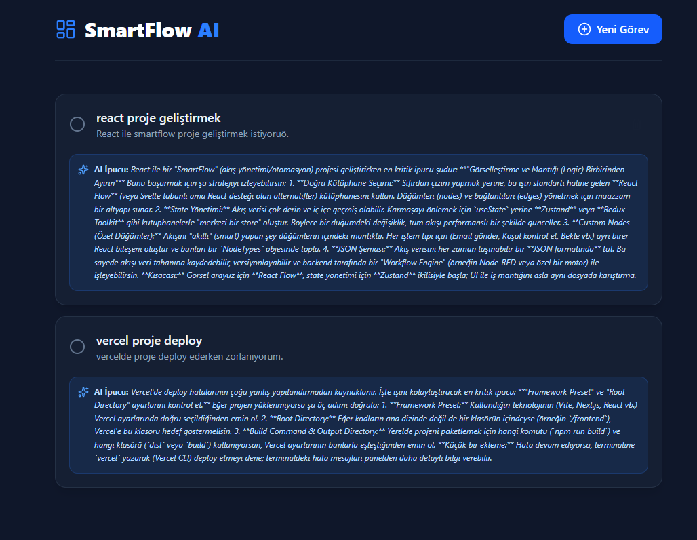
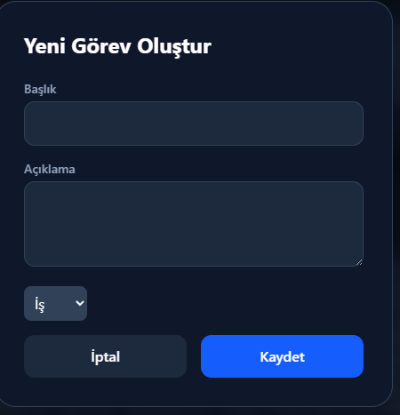

# 🚀 SmartFlow AI — Akıllı Görev Yönetim Sistemi

> MERN Stack + Google Gemini AI ile geliştirilmiş, kategori bazlı yapay zeka asistanına sahip üretkenlik uygulaması.

🌐 **Canlı Demo:** [smartflow-ai-task-manager-zkkh.vercel.app](https://smartflow-ai-task-manager-zkkh.vercel.app)

> ⚠️ İlk yüklemede 30-50 saniye gecikme olabilir. Render ücretsiz planı kullanıldığından servis uyku moduna giriyor.



---

## 🎯 Ne Yapar?

Kullanıcının eklediği görevi analiz ederek kategorisine göre (İş / Ders / Hobi) farklı bir AI karakteriyle akıllı tavsiyeler sunar. Sıradan bir to-do uygulamasının ötesine geçen, gerçek zamanlı AI entegrasyonlu bir üretkenlik aracıdır.

---

## ✨ Özellikler

- 🧠 **Kategori Bazlı AI Persona** — İş, Ders ve Hobi için ayrı yapay zeka üslubu
- ⚡ **Gemini Flash Entegrasyonu** — Google'ın en hızlı modeli ile anlık analiz
- 📋 **Görev Öncelik Yönetimi** — Dinamik öncelik sıralama
- 🔗 **Full-Stack Mimari** — React + Node.js + MongoDB ile uçtan uca geliştirme
- 🎨 **Modern UI** — Tailwind CSS ile responsive tasarım

---

## 🛠️ Teknoloji Stack

| Katman | Teknoloji |
|--------|-----------|
| Frontend | React.js, Vite, Tailwind CSS |
| Backend | Node.js, Express.js, REST API |
| Veritabanı | MongoDB Atlas |
| AI | Google Gemini API (gemini-flash-latest) |
| Deploy | Vercel (frontend), Render (backend) |

---

## 🚀 Kurulum

### Gereksinimler
- Node.js 18+
- MongoDB Atlas hesabı
- Google Gemini API Key ([buradan al](https://aistudio.google.com))

### Backend
```bash
cd server
cp .env.example .env
# GEMINI_API_KEY ve MONGO_URI değerlerini doldur
npm install
npm run dev
```

### Frontend
```bash
cd client
npm install
npm run dev
```

---

## 📸 Ekran Görüntüleri

| Görev Modalı | AI Analizi |
|-----------|------------|
|  |  |

---

## 👨‍💻 Geliştirici

**Yasin Arslan** — Bilgisayar Mühendisi  
📧 yasin19arslan07@gmail.com
